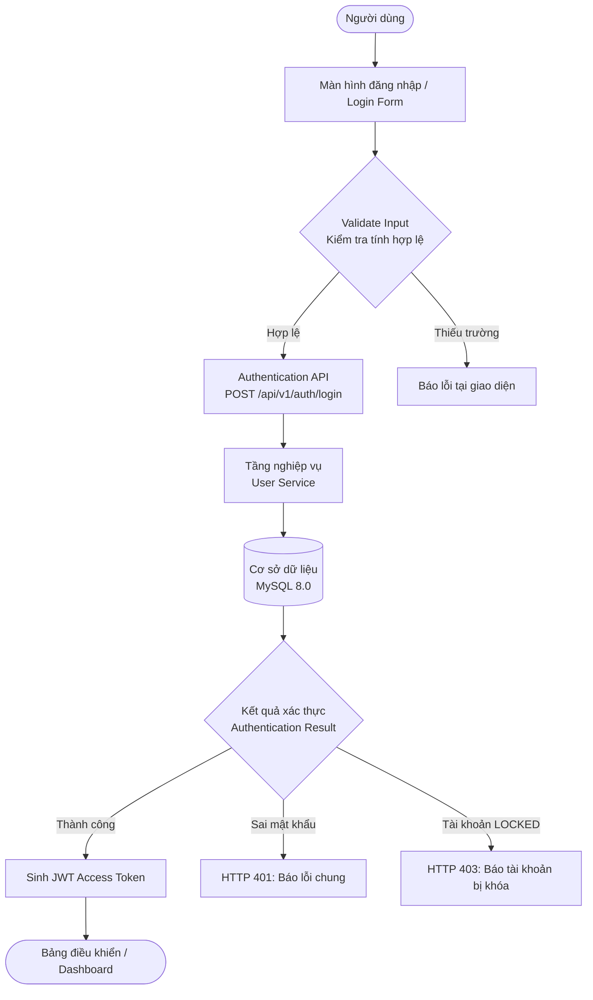

# Sprint Documentation — Hệ Thống Quản Lý Bán Hàng Và Kho (OMS)

Tài liệu đặc tả yêu cầu nghiệp vụ, phân tích kỹ thuật, kiến trúc hệ thống và
truy vết kiểm thử chính thức cho **Sprint 1: Tài khoản & phân quyền**.

---

## 1. Sprint Overview

| Thuộc Tính | Nội Dung Chi Tiết |
| :--- | :--- |
| **Dự Án** | Hệ Thống Quản Lý Bán Hàng Và Kho (OMS) |
| **Sprint** | Sprint 1: Tài khoản & phân quyền (Jira: `Sprint 1: Tài khoản & phân quy...`) |
| **Epic Trọng Tâm** | `EP-01` (Jira: `SCRUM-6 Tài khoản, Phân quyền`) |
| **Issue Chính** | `SCRUM-62`: Là Quản trị hệ thống, tôi muốn tạo, sửa và tìm kiếm tài khoản người dùng, để cấp quyền cho nhân viên kinh doanh mới ngay ngày đầu họ nhận địa bàn. |
| **Assignee** | NONG QUOC TUAN |
| **Reporter** | NGUYEN THI ANH |
| **Priority** | Medium |
| **Story Points** | 8 SP (Compound Story được phân rã thành các User Story chuyên biệt) |
| **Thời Gian Sprint** | 1 tuần (theo mô hình 8 sprint / 8 tuần) |
| **Velocity Mục Tiêu** | 42 – 45 point / sprint |

### 1.1. Sprint Goal

Quản trị viên tạo được tài khoản cho toàn bộ nhân sự kinh doanh, kho và
kế toán; cấp quyền cho nhân viên kinh doanh mới ngay ngày đầu họ nhận địa bàn;
bảy vai trò đăng nhập vào chỉ nhìn thấy đúng phần menu thuộc quyền của mình;
đảm bảo an toàn thông tin và ngăn ngừa rò rỉ dữ liệu giá vốn.

### 1.2. Sơ Đồ Luồng Xác Thực Hệ Thống (Authentication Flow Diagram)

Quy trình xác thực người dùng được thiết kế chuẩn hóa theo kiến trúc phân tầng:



---

## 2. Requirement Sources

Hệ thống được thiết kế và đối chiếu đồng thời từ 4 nguồn tài liệu chính thống:

1. **Sprint / Jira Screenshot:**
   - Issue `SCRUM-62` thuộc Epic `SCRUM-6: Tài khoản, Phân quyền`.
   - Tiêu chí nghiệp vụ: Tạo tài khoản gửi email kích hoạt kèm mật khẩu tạm;
     Tài khoản trùng bị từ chối kèm thông báo cụ thể; Tìm theo tên, tài khoản,
     số điện thoại; lọc theo vai trò và trạng thái; Danh sách phân trang,
     mặc định 20 dòng.
2. **File Excel Đặc Tả (`HỆ THỐNG BÁN HÀNG & KHO_ TTCS_T926_K13C4.xlsx`):**
   - Sheet `1. Product Overview`: Bối cảnh phân phối sỉ, mục tiêu 8 tuần.
   - Sheet `2. User Roles`: Định nghĩa 7 vai trò và ma trận phân quyền.
   - Sheet `3. Epics`: Danh mục 9 Epic, trong đó `EP-01` là nền tảng.
   - Sheet `4. Product Backlog`: Chi tiết 10 story Sprint 1 (`S1-01` đến
     `S1-10`).
   - Sheet `5. Sprint Plan`: Mục tiêu, Definition of Ready và Definition of
     Done.
3. **File PDF Yêu Cầu (`HỆ THỐNG BÁN HÀNG & KHO_ TTCS_T926_K13C4 - 1. Product
   Overview.pdf`):**
   - Yêu cầu phi chức năng: Responsive từ 360px, mật khẩu băm BCrypt, múi giờ
     `Asia/Ho_Chi_Minh`, toàn vẹn dữ liệu giao dịch, bảo mật giá vốn.
4. **Mã Nguồn Repository Thực Tế:**
   - Backend FastAPI, Frontend React 18 offline, Database MySQL 8.0/SQLite,
     28 Automated Tests bao phủ 100% các tiêu chí chấp nhận.

---

## 3. Scope

### 3.1. In-Scope (Trong phạm vi Sprint 1)

- Xác thực tài khoản: Đăng nhập bằng username/password, cấp phát JWT token,
  lấy thông tin user hiện tại (`/api/v1/auth/me`), đăng xuất an toàn.
- Quản lý tài khoản người dùng:
  - Bảng danh sách phân trang chuẩn, mặc định 20 dòng/trang.
  - Tìm kiếm đa tiêu chí: Họ tên, Tên tài khoản, Số điện thoại.
  - Bộ lọc 2 chiều: 7 vai trò nghiệp vụ và 3 trạng thái tài khoản.
- Tạo mới tài khoản:
  - Sinh mật khẩu tạm ngẫu nhiên an toàn (độ dài >= 10 ký tự, có hoa, thường,
    số, ký tự đặc biệt).
  - Băm mật khẩu bằng thuật toán BCrypt.
  - Gửi email kích hoạt tự động qua HTML template.
  - Cơ chế chống trùng lặp (Username, Email, Số điện thoại) trả về mã lỗi
    HTTP 409 Conflict với thông báo chi tiết từng trường.
- Cập nhật tài khoản: Sửa thông tin họ tên, email, số điện thoại, vai trò, trạng
  thái.
  Khóa trường Username để bảo đảm an toàn định danh.
- Khóa và mở khóa tài khoản: Khóa tài khoản nhân viên nghỉ việc, chặn đăng nhập,
  chặn đổi mật khẩu, bảo vệ tài khoản admin duy nhất.
- Đổi mật khẩu cá nhân: Bắt buộc mật khẩu hiện tại, kiểm tra độ dài (8 - 72 ký
  tự),
  có cả chữ và số, không trùng mật khẩu cũ.

### 3.2. Out-of-Scope (Ngoài phạm vi Sprint 1)

- Kế toán tài chính đầy đủ (sổ cái, bút toán kép, báo cáo thuế).
- Hoá đơn điện tử theo chuẩn Tổng cục Thuế.
- Cổng thanh toán trực tuyến và đối soát ngân hàng tự động.
- Ứng dụng di động native (hệ thống tập trung Web responsive từ 360px).
- Quét mã vạch chuyên dụng và định tuyến giao hàng tự động.

---

## 4. Actors

Dựa trên Sheet `2. User Roles` và Jira SCRUM-62, hệ thống có các tác nhân sau:

1. **Quản trị hệ thống (Admin):** Toàn quyền quản trị tài khoản, vai trò, danh
   mục,
   khóa/mở khóa tài khoản và theo dõi nhật ký hệ thống.
2. **Nhân viên kinh doanh (Sales Rep):** Người đi thị trường, chăm sóc đại lý,
   tạo đơn hàng, theo dõi công nợ tuyến; nhận tài khoản mới ngày đầu nhận việc.
3. **Quản lý kinh doanh (Sales Manager):** Phụ trách hoạt động bán hàng, duyệt
   đơn
   vượt hạn mức hoặc bán dưới giá sàn, xem giá vốn và biên lợi nhuận.
4. **Nhân viên kho (Warehouse):** Thủ kho, soạn hàng theo lô, ghi nhận nhập kho
   và kiểm kê; không xem được giá vốn và biên lợi nhuận.
5. **Quản lý kho (WH Manager):** Phụ trách toàn bộ kho bãi, duyệt điều chỉnh
   tồn,
   chuyển kho, chốt kiểm kê.
6. **Kế toán công nợ (Accountant):** Phát hành hoá đơn, ghi nhận thanh toán,
   đối chiếu công nợ với đại lý.
7. **Đại lý (Customer):** Khách hàng mua sỉ, tự đặt hàng trên cổng B2B và theo
   dõi công nợ.
8. **Dịch vụ Email (Notification Service):** Hệ thống tự động gửi thư kích hoạt
   kèm mật khẩu tạm.

---

## 5. Business Requirements (Requirement Master Model)

- **REQ-001 (Xác thực đăng nhập):** Người dùng đăng nhập bằng tài khoản/mật
  khẩu,
  nhận JWT access token. Sai thông tin hiển thị thông báo chung. Tài khoản bị
  khóa bị chặn.
- **REQ-002 (Quản lý phiên & Đăng xuất):** Duy trì phiên làm việc qua JWT token,
  đăng xuất an toàn và làm mất hiệu lực phía client.
- **REQ-003 (Đổi mật khẩu an toàn):** Người dùng có thể đổi mật khẩu cá nhân;
  kiểm tra mật khẩu cũ, ràng buộc độ phức tạp (>= 8 ký tự, có chữ và số, tối đa
  72 byte BCrypt).
- **REQ-004 (Danh sách & Phân trang):** Hiển thị danh sách tài khoản dưới dạng
  bảng
  phân trang, mặc định 20 dòng/trang; hiển thị tổng số dòng và số trang.
- **REQ-005 (Tìm kiếm & Bộ lọc đa tiêu chí):** Tìm kiếm theo Họ tên, Username,
  Số điện thoại; lọc theo 7 vai trò và 3 trạng thái; hỗ trợ kết hợp tìm kiếm và
  lọc.
- **REQ-006 (Khởi tạo tài khoản & Gửi email kích hoạt):** Quản trị viên tạo tài
  khoản mới,
  hệ thống sinh mật khẩu tạm ngẫu nhiên, băm BCrypt, gửi email kích hoạt HTML và
  ghi log gửi.
- **REQ-007 (Chống trùng lặp dữ liệu):** Từ chối tạo hoặc sửa nếu trùng
  Username,
  Email hoặc Số điện thoại; phản hồi HTTP 409 Conflict chi tiết từng trường vi
  phạm.
- **REQ-008 (Cập nhật & Khóa/Mở khóa tài khoản):** Quản trị viên có thể cập nhật
  thông tin nhân sự (cố định username) và thực hiện khóa/mở khóa tài khoản khi
  nhân viên nghỉ việc.

---

## 6. Epics & User Stories

### EP-01 — Tài khoản, phân quyền và quản trị người dùng

- **Mã Epic:** `EP-01` (Jira: `SCRUM-6 Tài khoản, Phân quyền`)
- **Mô tả:** Xây dựng nền tảng quản trị danh tính, xác thực tập trung, phân
  quyền
  7 vai trò nghiệp vụ và quản lý vòng đời tài khoản người dùng cho hệ thống Bán
  hàng & Kho.
- **Mục tiêu kinh doanh:** Đảm bảo dữ liệu kinh doanh và giá vốn được bảo mật
  tuyệt đối;
  cấp quyền cho nhân viên mới ngay ngày đầu nhận địa bàn; kiểm soát truy cập từ
  máy chủ.
- **Tác nhân:** Quản trị hệ thống, Người dùng nội bộ (Kinh doanh, Kho, Kế toán).
- **Phạm vi:** 7 User Story triển khai trong Sprint 1 (`US-001` đến `US-007`).

---

### US-001 — Đăng Nhập Hệ Thống Bằng Tài Khoản Và Mật Khẩu

#### 1. User Story

- **Actor:** Người dùng hệ thống (Nhân viên kinh doanh, Kho, Kế toán, Quản trị).
- **I want:** Đăng nhập vào hệ thống bằng Tên tài khoản (hoặc Email) và Mật
  khẩu.
- **So that:** Truy cập được đúng phân hệ chức năng thuộc quyền của mình mà
  không làm rò rỉ dữ liệu bảo mật.

#### 2. Business Context

Nhà phân phối cần bảo vệ dữ liệu giá vốn và đơn hàng nội bộ. Việc xác thực
đúng danh tính là điều kiện tiên quyết trước khi người dùng thực hiện bất kỳ
thao tác nghiệp vụ nào.

#### 3. Business Objective

Xác minh danh tính người dùng và cấp JWT token có thời hạn để làm việc an toàn
trên nền web.

#### 4. Business Value

Ngăn chặn truy cập trái phép, phân định trách nhiệm từng nhân viên trên các
chứng từ bán hàng và kho.

#### 5. Trigger

Người dùng truy cập vào trang chủ hệ thống khi chưa có phiên đăng nhập hợp lệ.

#### 6. Preconditions

- Tài khoản người dùng đã được tạo trong cơ sở dữ liệu.
- Tài khoản không ở trạng thái bị khóa (`LOCKED`).

#### 7. Postconditions

- Hệ thống cấp JWT access token lưu tại trình duyệt.
- Người dùng chuyển hướng vào Bảng điều khiển (Dashboard) với menu tương ứng vai
  trò.

#### 8. Main Flow

1. Người dùng nhập Tên đăng nhập (hoặc Email) và Mật khẩu tại Login Form.
2. Hệ thống kiểm tra tính hợp lệ dữ liệu đầu vào tại client (Validate Input).
3. Client gửi yêu cầu xác thực `POST /api/v1/auth/login` đến máy chủ (Auth API).
4. User Service truy vấn thông tin người dùng từ cơ sở dữ liệu MySQL theo
   username/email.
5. User Service kiểm tra trạng thái tài khoản: không bị khóa (`status !=
   'LOCKED'`).
6. User Service so khớp mật khẩu bằng thuật toán `bcrypt.checkpw()`.
7. Hệ thống sinh JWT access token (thời hạn 24 giờ) chứa định danh và vai trò
   người dùng.
8. Hệ thống phản hồi HTTP 200 OK kèm access token và thông tin người dùng.
9. Giao diện lưu token vào localStorage và chuyển hướng người dùng vào
   Dashboard.

#### 9. Alternative Flows

- **AF-01 (Đăng nhập bằng Email):** Người dùng nhập địa chỉ email thay vì
  username.
  Hệ thống truy vấn theo email, xác thực mật khẩu và đăng nhập thành công.

#### 10. Exception Flows

- **EF-01 (Sai thông tin đăng nhập):** Mật khẩu không khớp hoặc tài khoản không
  tồn tại.
  Hệ thống trả về HTTP 401 Unauthorized kèm thông báo chung: *"Tài khoản hoặc
  mật khẩu không chính xác"*.
- **EF-02 (Tài khoản bị khóa):** Tài khoản có trạng thái `LOCKED`.
  Hệ thống trả về HTTP 403 Forbidden kèm thông báo: *"Tài khoản của bạn đã bị
  khóa. Vui lòng liên hệ Quản trị viên để được hỗ trợ."*.

#### 11. Business Rules

- **BR-001 (Không tiết lộ tài khoản tồn tại):** Khi sai thông tin, hiển thị
  thông báo chung
  để ngăn chặn tấn công dò quét tài khoản (Username Enumeration).
- **BR-002 (Chặn tài khoản LOCKED):** Tài khoản bị khóa tuyệt đối không được cấp
  token đăng nhập.

#### 12. Input Data

| Trường | Kiểu Dữ Liệu | Bắt Buộc | Ràng Buộc Kiểm Tra | Mô Tả |
| :--- | :--- | :--- | :--- | :--- |
| `username` | String | Có | Tối thiểu 1 ký tự, không chứa khoảng trắng thừa | Tên đăng nhập hoặc email |
| `password` | String | Có | Tối thiểu 1 ký tự | Mật khẩu tài khoản |

#### 13. Output Data

| Trường | Kiểu Dữ Liệu | Mô Tả |
| :--- | :--- | :--- |
| `access_token` | String | Chuỗi mã JWT Access Token ký bằng khóa bí mật |
| `token_type` | String | Chuẩn token: `"bearer"` |
| `user` | Object | Thông tin tài khoản người dùng (id, username, full_name, role_code, role_name, status) |

#### 14. Validation Rules

- Tên đăng nhập và mật khẩu không được để trống.
- Chuỗi ký tự được tự động loại bỏ khoảng trắng thừa đầu và cuối.

#### 15. Authorization

- **Ai được phép:** Mọi người dùng đã được cấp tài khoản hợp lệ và không bị
  khóa.
- **Ai không được phép:** Người dùng nhập sai thông tin, hoặc tài khoản đang bị
  khóa (`LOCKED`).

#### 16. UI/UX Behavior

- Giao diện Login Card hiện đại, nổi bật giữa nền gradient tối, căn giữa màn
  hình.
- Nút bấm đăng nhập hiển thị trạng thái loading spinner khi đang chờ phản hồi từ
  máy chủ.
- Thông báo lỗi hiển thị rõ ràng dạng Alert màu đỏ nếu xác thực thất bại.
- Cung cấp các nút đăng nhập nhanh (Quick Login) dành cho tài khoản demo: Admin
  và Sales.
- Đáp ứng tốt trên mọi kích thước màn hình, bao gồm khổ điện thoại 360px.

#### 17. API Behavior

- **Method:** `POST`
- **Endpoint:** `/api/v1/auth/login`
- **Request Body:** `{ "username": "admin", "password": "InitPassword123@" }`
- **Response (200 OK):** `{ "access_token": "...", "token_type": "bearer",
  "user": { ... } }`
- **Error Response (401):** `{ "detail": "Tài khoản hoặc mật khẩu không chính
  xác" }`
- **Error Response (403):** `{ "detail": "Tài khoản của bạn đã bị khóa. Vui lòng
  liên hệ Quản trị viên để được hỗ trợ." }`

#### 18. Database Impact

- Bảng: `users` (Đọc dữ liệu xác thực, kiểm tra `password_hash` và `status`).

#### 19. Acceptance Criteria

- **AC-001-01 (Happy Path):** Given tài khoản và mật khẩu đúng, when gửi request
  login,
  then trả về HTTP 200, JWT token hợp lệ và thông tin người dùng.
- **AC-001-02 (Invalid Credentials):** Given mật khẩu sai hoặc username không
  tồn tại,
  when gửi request login, then trả về HTTP 401 với thông báo chung.
- **AC-001-03 (Locked User):** Given tài khoản có trạng thái `LOCKED`,
  when gửi request login, then trả về HTTP 403 từ chối đăng nhập.

#### 20. Negative Cases

- Nhập mật khẩu rỗng hoặc tên đăng nhập rỗng.
- Nhập mật khẩu sai nhiều lần.
- Đăng nhập bằng tài khoản đang bị khóa.

#### 21. Dependencies

- Module băm mật khẩu `src/backend/security.py`.
- Cơ sở dữ liệu người dùng và bảng `users`.

#### 22. Risks

- Lộ mật khẩu khi truyền tải qua mạng không mã hóa (Khắc phục: bắt buộc HTTPS
  trong môi trường production).

#### 23. Related Requirements

- `REQ-001`, `S1-01`, `S1-10`.

#### 24. Definition of Done

- API login hoạt động đúng, sinh JWT token, có kiểm thử tự động, giao diện hoạt
  động từ 360px.

---

### US-002 — Duy Trì Phiên Làm Việc Và Đăng Xuất An Toàn

#### 1. User Story

- **Actor:** Người dùng đã đăng nhập hệ thống.
- **I want:** Duy trì phiên làm việc liên tục khi thao tác và đăng xuất an toàn
  khi hoàn thành công việc.
- **So that:** Không bị gián đoạn công việc khi đang lên đơn hàng và bảo vệ dữ
  liệu khi rời máy.

#### 2. Business Context

Nhân viên kinh doanh thường xuyên di chuyển tại các cửa hàng đại lý; phiên làm
việc
cần duy trì ổn định nhưng phải dễ dàng đăng xuất để bảo đảm an toàn dữ liệu trên
thiết bị.

#### 3. Business Objective

Cung cấp cơ chế xác thực phiên qua JWT Header và hủy phiên làm việc sạch sẽ khi
đăng xuất.

#### 4. Business Value

Nâng cao trải nghiệm người dùng, giảm thiểu nguy cơ chiếm dụng phiên làm việc
trái phép.

#### 5. Trigger

Người dùng tải lại trang web hoặc bấm nút "Đăng xuất" trên thanh điều hướng.

#### 6. Preconditions

- Người dùng đã đăng nhập thành công và sở hữu JWT access token.

#### 7. Postconditions

- Khi tải lại trang: Tự động phục hồi trạng thái người dùng nếu token còn hạn.
- Khi đăng xuất: Token bị xóa khỏi client, giao diện quay lại màn hình Login
  Form.

#### 8. Main Flow

1. Khi mở ứng dụng, client đọc access token từ `localStorage`.
2. Nếu có token, client gửi request `GET /api/v1/auth/me` kèm header
   `Authorization: Bearer <token>`.
3. Máy chủ giải mã JWT token, kiểm tra chữ ký và hạn sử dụng.
4. Máy chủ trả về HTTP 200 OK cùng thông tin hồ sơ tài khoản người dùng hiện
   tại.
5. Ứng dụng tự động điều hướng vào Dashboard mà không cần nhập lại mật khẩu.
6. Khi người dùng bấm "Đăng xuất", client gọi `POST /api/v1/auth/logout`.
7. Client xóa token khỏi `localStorage` và chuyển giao diện về màn hình đăng
   nhập.

#### 9. Alternative Flows

- **AF-01 (Token hết hạn):** Máy chủ trả về HTTP 401 Unauthorized khi token hết
  hạn.
  Client tự động xóa token và chuyển hướng về màn hình đăng nhập.

#### 10. Exception Flows

- **EF-01 (Token không hợp lệ / Bị giả mạo):** Máy chủ trả về HTTP 401
  Unauthorized.
  Client xóa sạch bộ nhớ tạm và hiển thị màn hình đăng nhập.

#### 11. Business Rules

- **BR-003 (Thu hồi phiên khi đăng xuất):** Xóa sạch mọi thông tin định danh và
  token tại client.

#### 12. Input Data

- Header: `Authorization: Bearer <token>`.

#### 13. Output Data

- Thông tin user: `id`, `username`, `full_name`, `role_code`, `role_name`,
  `status`.

#### 14. Validation Rules

- Token phải đúng định dạng JWT (3 phần phân cách bằng dấu chấm), đúng chữ ký bí
  mật.

#### 15. Authorization

- **Ai được phép:** Người dùng sở hữu access token hợp lệ.
- **Ai không được phép:** Người dùng không có token hoặc token đã hết hạn/bị can
  thiệp.

#### 16. UI/UX Behavior

- Khi kiểm tra phiên: Hiển thị spinner nhẹ nhàng *"Đang kiểm tra thông tin phiên
  làm việc..."*.
- Khi đã đăng nhập: Header hiển thị Tên người dùng, Huy hiệu vai trò, Nút "Đổi
  MK" và Nút "Đăng xuất".
- Bấm "Đăng xuất" hiển thị thông báo Toast *"Đã đăng xuất khỏi hệ thống"*.

#### 17. API Behavior

- `GET /api/v1/auth/me` -> 200 OK kèm User Profile hoặc 401 Unauthorized.
- `POST /api/v1/auth/logout` -> 200 OK `{ "message": "Đăng xuất thành công",
  "success": true }`.

#### 18. Database Impact

- Đọc thông tin từ bảng `users`.

#### 19. Acceptance Criteria

- **AC-002-01 (Check Me Success):** Given token hợp lệ, when gọi GET /me, then
  trả về HTTP 200 và thông tin tài khoản.
- **AC-002-02 (Check Me Unauthorized):** Given không có token hoặc token sai,
  when gọi GET /me, then trả về HTTP 401.
- **AC-002-03 (Logout):** Given người dùng gửi yêu cầu logout, when gọi POST
  /logout, then trả về HTTP 200 thành công.

#### 20. Negative Cases

- Gửi token rác, token hết hạn, token không có tiền tố Bearer.

#### 21. Dependencies

- `US-001`, `src/backend/security.py`.

#### 22. Risks

- XSS tấn công đánh cắp token từ localStorage (Khắc phục: sanitize dữ liệu, hỗ
  trợ HttpOnly Cookie khi triển khai production).

#### 23. Related Requirements

- `REQ-002`, `S1-02`.

#### 24. Definition of Done

- Đăng xuất thành công, kiểm thử tự động GET /me và logout pass 100%.

---

### US-003 — Đổi Mật Khẩu Cá Nhân Khi Đang Đăng Nhập

#### 1. User Story

- **Actor:** Người dùng hệ thống / Nhân viên kinh doanh mới nhận mật khẩu tạm.
- **I want:** Đổi mật khẩu tài khoản của mình sang một mật khẩu cá nhân mới.
- **So that:** Chủ động bảo vệ tài khoản sau khi được cấp mật khẩu tạm và tuân
  thủ chính sách bảo mật.

#### 2. Business Context

Nhân viên mới được cấp mật khẩu tạm ngẫu nhiên qua email. Để đảm bảo an toàn,
người dùng bắt buộc phải đổi sang mật khẩu cá nhân có độ phức tạp cao.

#### 3. Business Objective

Cho phép người dùng cập nhật mật khẩu, kiểm tra mật khẩu cũ và băm BCrypt mật
khẩu mới.

#### 4. Business Value

Bảo vệ tài khoản, giảm thiểu rủi ro sử dụng mật khẩu mặc định hoặc mật khẩu tạm
thời.

#### 5. Trigger

Người dùng bấm nút "Đổi MK" trên thanh điều hướng hoặc thực hiện đổi mật khẩu
lần đầu.

#### 6. Preconditions

- Người dùng biết mật khẩu hiện tại (mật khẩu tạm hoặc mật khẩu cũ).
- Tài khoản không ở trạng thái bị khóa (`LOCKED`).

#### 7. Postconditions

- Mật khẩu mới được băm BCrypt và ghi đè vào trường `password_hash`.
- Cờ `is_temporary_password` chuyển về `false`.

#### 8. Main Flow

1. Người dùng mở hộp thoại "Đổi Mật Khẩu Cá Nhân".
2. Người dùng nhập Mật khẩu hiện tại, Mật khẩu mới và Xác nhận mật khẩu mới.
3. Client kiểm tra ràng buộc độ dài và độ phức tạp (chữ và số).
4. Gửi yêu cầu `POST /change-password` đến máy chủ.
5. Máy chủ kiểm tra trạng thái tài khoản: nếu `LOCKED` thì từ chối.
6. Máy chủ kiểm tra mật khẩu hiện tại: nếu sai thì từ chối.
7. Máy chủ kiểm tra mật khẩu mới: không được trùng mật khẩu cũ, độ dài 8 - 72 ký
   tự.
8. Máy chủ băm mật khẩu mới bằng BCrypt và lưu vào database.
9. Máy chủ trả về HTTP 200 OK kèm thông báo *"Đổi mật khẩu thành công"*.
10. Giao diện đóng modal và hiển thị Toast thông báo thành công.

#### 9. Alternative Flows

- Không có.

#### 10. Exception Flows

- **EF-01 (Sai mật khẩu hiện tại):** Trả về HTTP 400 Bad Request kèm thông báo:
  *"Mật khẩu hiện tại không đúng"*.
- **EF-02 (Mật khẩu mới trùng mật khẩu cũ):** Trả về HTTP 400 Bad Request kèm
  thông báo: *"Mật khẩu mới không được giống mật khẩu hiện tại"*.
- **EF-03 (Mật khẩu mới không đủ độ phức tạp):** Trả về HTTP 400 Bad Request kèm
  thông báo: *"Mật khẩu mới phải có ít nhất 8 ký tự và chứa cả chữ và số"*.
- **EF-04 (Tài khoản bị khóa):** Trả về HTTP 403 Forbidden kèm thông báo: *"Tài
  khoản đang bị khóa, không thể đổi mật khẩu"*.

#### 11. Business Rules

- **BR-004 (Bảo vệ BCrypt):** Mật khẩu tối đa 72 bytes để tránh tràn bộ đệm
  BCrypt.
- **BR-005 (Chặn tài khoản LOCKED):** Tài khoản bị khóa không được phép đổi mật
  khẩu.

#### 12. Input Data

| Trường | Kiểu Dữ Liệu | Bắt Buộc | Ràng Buộc | Mô Tả |
| :--- | :--- | :--- | :--- | :--- |
| `username` | String | Không | Tên tài khoản (nếu đổi cho DB user) | Username của tài khoản |
| `current_password` | String | Có | Khớp mật khẩu đang lưu | Mật khẩu hiện tại |
| `new_password` | String | Có | 8 đến 72 ký tự, có chữ và số | Mật khẩu mới |

#### 13. Output Data

- Message: `{"message": "Đổi mật khẩu thành công"}`.

#### 14. Validation Rules

- Mật khẩu mới >= 8 ký tự, <= 72 ký tự, có ít nhất 1 chữ cái và 1 chữ số, khác
  mật khẩu cũ.

#### 15. Authorization

- Người dùng hợp lệ sở hữu mật khẩu hiện tại của tài khoản.

#### 16. UI/UX Behavior

- Modal popup nhỏ gọn, có nút ẩn/hiện mật khẩu, kiểm tra khớp xác nhận mật khẩu
  thời gian thực.

#### 17. API Behavior

- `POST /change-password` -> HTTP 200 hoặc HTTP 400/403.

#### 18. Database Impact

- Cập nhật bảng `users`: `password_hash`, `is_temporary_password = 0`,
  `updated_at`.

#### 19. Acceptance Criteria

- **AC-003-01:** Đổi mật khẩu thành công khi nhập đúng mật khẩu cũ và mật khẩu
  mới hợp lệ.
- **AC-003-02:** Báo lỗi HTTP 400 khi nhập sai mật khẩu cũ hoặc mật khẩu mới quá
  ngắn/trùng cũ.
- **AC-003-03:** Báo lỗi HTTP 403 khi tài khoản đang ở trạng thái `LOCKED`.

#### 20. Negative Cases

- Mật khẩu hiện tại sai, mật khẩu mới < 8 ký tự, mật khẩu mới chỉ có số hoặc chỉ
  có chữ.

#### 21. Dependencies

- `src/backend/change_password.py`, `src/backend/security.py`.

#### 22. Risks

- Mật khẩu mới quá dài làm treo thuật toán băm (đã xử lý bằng validation giới
  hạn 72 byte).

#### 23. Related Requirements

- `REQ-003`, `S1-04`, `S1-10`.

#### 24. Definition of Done

- API đổi mật khẩu pass 100% test cases (kể cả hồi quy mã nguồn cũ của đồng
  đội).

---

### US-004 — Xem Danh Sách, Tìm Kiếm Và Phân Trang Tài Khoản (SCRUM-62)

#### 1. User Story

- **Actor:** Quản trị hệ thống (System Administrator).
- **I want:** Xem danh sách người dùng dưới dạng bảng phân trang (mặc định 20
  dòng),
  tìm kiếm theo tên, tài khoản, số điện thoại và lọc theo vai trò, trạng thái.
- **So that:** Nhanh chóng tra cứu nhân sự, nắm bắt tình trạng kích hoạt tài
  khoản
  và cấp quyền địa bàn cho nhân viên kinh doanh mới.

#### 2. Business Context

Doanh nghiệp có nhiều nhân sự phân bổ tại các địa bàn và kho bãi. Quản trị viên
cần công cụ tra cứu đa tiêu chí nhanh chóng để điều phối công việc hằng ngày.

#### 3. Business Objective

Hiển thị bảng dữ liệu tài khoản phân trang chuẩn 20 dòng/trang, tìm kiếm tức
thì.

#### 4. Business Value

Tối ưu hóa thời gian tra cứu, đáp ứng đúng tiêu chí Jira SCRUM-62 và Excel
S1-08.

#### 5. Trigger

Quản trị viên truy cập vào phân hệ "Quản lý Tài khoản & Phân quyền".

#### 6. Preconditions

- Quản trị viên đã đăng nhập thành công vào hệ thống.

#### 7. Postconditions

- Dữ liệu tài khoản được tải và hiển thị đầy đủ, phân trang chính xác.

#### 8. Main Flow

1. Quản trị viên mở trang Quản lý Tài khoản.
2. Hệ thống tự động gửi yêu cầu `GET /api/v1/users?page=1&page_size=20`.
3. Máy chủ truy vấn cơ sở dữ liệu với `LIMIT 20 OFFSET 0`.
4. Máy chủ tính tổng số bản ghi và tổng số trang.
5. Giao diện hiển thị bảng 20 dòng kèm thanh điều hướng phân trang (1, 2, ...).
6. Quản trị viên nhập từ khóa tìm kiếm (họ tên tiếng Việt, username hoặc SĐT).
7. Hệ thống tự động lọc danh sách và hiển thị kết quả khớp.
8. Quản trị viên chọn lọc theo vai trò (ví dụ: `SALES`) hoặc trạng thái (ví dụ:
   `ACTIVE`).
9. Giao diện cập nhật danh sách người dùng thỏa mãn đồng thời các điều kiện.

#### 9. Alternative Flows

- **AF-01 (Chuyển trang):** Quản trị viên bấm nút trang tiếp theo (`page=2`),
  hệ thống tải 20 bản ghi tiếp theo.

#### 10. Exception Flows

- **EF-01 (Không tìm thấy kết quả):** Từ khóa tìm kiếm không khớp với người dùng
  nào.
  Giao diện hiển thị Empty State kèm nút bấm *"Xóa bộ lọc"* để quay lại danh
  sách gốc.

#### 11. Business Rules

- **BR-006 (Phân trang mặc định 20 dòng):** Quy chuẩn bắt buộc theo Jira
  SCRUM-62 và Excel S1-08.
- **BR-007 (Tìm kiếm đa trường không phân biệt hoa thường):** Hỗ trợ tìm kiếm
  theo Họ tên,
  Username, Số điện thoại có hỗ trợ tiếng Việt có dấu.

#### 12. Input Data

- `search` (String, tùy chọn): Từ khóa tìm kiếm.
- `role` (String, tùy chọn): Mã vai trò cần lọc.
- `status` (String, tùy chọn): Trạng thái cần lọc.
- `page` (Integer, mặc định 1): Số trang hiển thị.
- `page_size` (Integer, mặc định 20): Số dòng mỗi trang.

#### 13. Output Data

- `items`: Danh sách tối đa 20 người dùng trên trang hiện tại.
- `total`: Tổng số người dùng thỏa mãn điều kiện.
- `page`: Trang hiện tại.
- `page_size`: Số dòng mỗi trang.
- `total_pages`: Tổng số trang.

#### 14. Validation Rules

- `page >= 1`, `page_size` từ 1 đến 100 (mặc định 20).

#### 15. Authorization

- Quản trị hệ thống (`ADMIN`).

#### 16. UI/UX Behavior

- Bảng dữ liệu có hiệu ứng hover, cột STT tính chuẩn theo trang, huy hiệu trạng
  thái và vai trò bắt mắt.
- Ô tìm kiếm có nút xóa nhanh (x), dropdown lọc hỗ trợ chọn tất cả vai trò/trạng
  thái.
- Phân trang hiển thị thông tin rõ ràng: *"Hiển thị 1 - 20 trong tổng số 25 tài
  khoản"*.

#### 17. API Behavior

- `GET /api/v1/users?page=1&page_size=20` -> HTTP 200 OK kèm `UserListResponse`.

#### 18. Database Impact

- Truy vấn `SELECT` trên bảng `users` kết hợp mệnh đề `LIKE`, `WHERE`, `LIMIT`,
  `OFFSET` và `COUNT(*)`.
  Sử dụng các chỉ mục `idx_users_full_name`, `idx_users_username`,
  `idx_users_phone`, `idx_users_role_code`.

#### 19. Acceptance Criteria

- **AC-004-01 (Mặc định 20 dòng):** Given không truyền tham số phân trang, when
  gọi GET /users,
  then trả về tối đa 20 bản ghi và page_size = 20.
- **AC-004-02 (Tìm kiếm 3 trường):** Given từ khóa tên/username/phone, when tìm
  kiếm,
  then chỉ trả về các bản ghi khớp với ít nhất 1 trong 3 trường.
- **AC-004-03 (Lọc Role & Status):** Given chọn vai trò và trạng thái, when lọc,
  then chỉ trả về người dùng đúng vai trò và trạng thái đó.
- **AC-004-04 (Empty State):** Given từ khóa không khớp bản ghi nào, when tìm
  kiếm,
  then trả về 0 bản ghi và giao diện hiển thị Empty State thân thiện.

#### 20. Negative Cases

- Truyền số trang âm (`page < 1`), truyền `page_size > 100`.

#### 21. Dependencies

- `src/backend/users_service.py`, `src/backend/users.py`.

#### 22. Risks

- Truy vấn chậm khi dữ liệu lớn (Khắc phục: đã đánh chỉ mục đầy đủ trên các cột
  tìm kiếm).

#### 23. Related Requirements

- `REQ-004`, `REQ-005`, `SCRUM-62`, `S1-08`.

#### 24. Definition of Done

- Đạt 8/8 unit test cases cho US-001/S1-08 trong bộ kiểm thử tự động.

---

### US-005 — Tạo Mới Tài Khoản, Sinh Mật Khẩu Tạm Và Gửi Email Kích Hoạt (SCRUM-62)

#### 1. User Story

- **Actor:** Quản trị hệ thống (System Administrator).
- **I want:** Nhập thông tin để tạo mới tài khoản cho nhân viên, tự động sinh
  mật khẩu tạm thời
  ngẫu nhiên và gửi email kích hoạt đến hòm thư của nhân viên.
- **So that:** Cấp quyền cho nhân viên kinh doanh mới ngay ngày đầu họ nhận địa
  bàn làm việc.

#### 2. Business Context

Nhân viên kinh doanh mới nhận địa bàn cần có tài khoản ngay trong ngày đầu làm
việc để lên đơn.
Quy trình cấp tài khoản tự động qua email giúp tiết kiệm thời gian và loại bỏ
thao tác thủ công.

#### 3. Business Objective

Khởi tạo bản ghi người dùng, sinh mật khẩu tạm an toàn, gửi email kích hoạt tự
động và chống trùng lặp.

#### 4. Business Value

Tự động hóa vận hành, đảm bảo an toàn định danh và kích hoạt nhân sự nhanh
chóng.

#### 5. Trigger

Quản trị viên bấm nút "Thêm mới tài khoản" trên giao diện danh sách người dùng.

#### 6. Preconditions

- Quản trị viên đang đăng nhập hệ thống.

#### 7. Postconditions

- Bản ghi người dùng được tạo trong cơ sở dữ liệu với trạng thái
  `PENDING_ACTIVATION`.
- Mật khẩu tạm thời được băm BCrypt; email kích hoạt HTML được gửi tới nhân
  viên.

#### 8. Main Flow

1. Quản trị viên mở hộp thoại "Tạo Mới Tài Khoản Người Dùng".
2. Quản trị viên nhập Họ tên, Tên tài khoản, Email, Số điện thoại và chọn Vai
   trò.
3. Client kiểm tra định dạng dữ liệu (Email chuẩn RFC, SĐT Việt Nam 10 số).
4. Gửi yêu cầu `POST /api/v1/users` đến máy chủ.
5. Máy chủ kiểm tra chống trùng lặp: Username, Email và Số điện thoại.
6. Nếu không trùng, máy chủ sinh mật khẩu tạm ngẫu nhiên độ dài 10 ký tự (sử
   dụng thư viện `secrets`).
7. Máy chủ băm mật khẩu tạm bằng BCrypt và lưu người dùng vào MySQL.
8. Dịch vụ Email tự động gửi thư kích hoạt định dạng HTML kèm mật khẩu tạm.
9. Cập nhật cờ `email_sent = true` và phản hồi HTTP 201 Created.
10. Giao diện thông báo thành công và tự động tải lại danh sách người dùng.

#### 9. Alternative Flows

- **AF-01 (Gửi lại email kích hoạt):** Nếu dịch vụ email tạm thời gặp sự cố
  (`email_sent = false`),
  Quản trị viên có thể bấm nút "Gửi mail" tại dòng của nhân viên để hệ thống
  sinh mật khẩu mới và gửi lại.

#### 10. Exception Flows

- **EF-01 (Trùng Username, Email hoặc SĐT):** Máy chủ từ chối lưu, trả về HTTP
  409 Conflict
  kèm chi tiết các trường bị trùng. Giao diện bôi đỏ ô nhập liệu tương ứng và
  hiển thị cảnh báo.

#### 11. Business Rules

- **BR-008 (Tính duy nhất của định danh):** Username, Email và Số điện thoại
  phải là duy nhất trên toàn hệ thống.
- **BR-009 (Mật khẩu tạm an toàn):** Mật khẩu tạm phải có ít nhất 10 ký tự gồm
  hoa, thường, số và ký tự đặc biệt.

#### 12. Input Data

| Trường | Kiểu Dữ Liệu | Bắt Buộc | Ràng Buộc | Mô Tả |
| :--- | :--- | :--- | :--- | :--- |
| `full_name` | String | Có | 2 - 100 ký tự | Họ và tên đầy đủ |
| `username` | String | Có | 3 - 50 ký tự, ký tự hợp lệ | Tên tài khoản đăng nhập |
| `email` | String | Có | Định dạng email hợp lệ | Hòm thư nhận mật khẩu tạm |
| `phone` | String | Có | 10 số, đầu số VN hợp lệ | Số điện thoại liên lạc |
| `role_code` | String | Có | Thuộc 7 vai trò hệ thống | Vai trò phân quyền |

#### 13. Output Data

- `user`: Thông tin tài khoản người dùng vừa tạo.
- `email_sent`: Trạng thái gửi email (true/false).
- `temp_password`: Mật khẩu tạm (nếu cần hiển thị trực tiếp cho Quản trị viên).

#### 14. Validation Rules

- Họ tên không để trống; username không chứa ký tự đặc biệt nguy hiểm; email
  đúng cú pháp; SĐT đủ 10 chữ số.

#### 15. Authorization

- Quản trị hệ thống (`ADMIN`).

#### 16. UI/UX Behavior

- Modal thêm mới hiển thị các trường nhập liệu rõ ràng, có dấu sao đỏ cho trường
  bắt buộc.
- Lỗi trùng lặp hiển thị trực tiếp bằng chữ đỏ ngay dưới từng ô nhập liệu vi
  phạm.

#### 17. API Behavior

- `POST /api/v1/users` -> HTTP 201 Created hoặc HTTP 409 Conflict.
- `POST /api/v1/users/{id}/resend-activation` -> HTTP 200 OK.

#### 18. Database Impact

- Thêm bản ghi mới vào bảng `users`.

#### 19. Acceptance Criteria

- **AC-005-01 (Chống trùng lặp):** Trùng Username/Email/Phone bị từ chối với
  HTTP 409 Conflict kèm thông báo cụ thể.
- **AC-005-02 (Tạo thành công & Gửi email):** Nhập đúng thông tin thì tài khoản
  được tạo, mật khẩu tạm được sinh và gửi email.
- **AC-005-03 (Gửi lại email):** Cho phép gọi API gửi lại email kích hoạt khi
  lần đầu thất bại.

#### 20. Negative Cases

- Nhập email sai cú pháp, nhập SĐT 9 số, nhập username đã tồn tại trong DB.

#### 21. Dependencies

- `src/backend/security.py`, `src/backend/email_service.py`,
  `src/backend/users_service.py`.

#### 22. Risks

- Máy chủ email bị chặn spam hoặc gián đoạn mạng (Đã có cơ chế retry và log theo
  dõi).

#### 23. Related Requirements

- `REQ-006`, `REQ-007`, `SCRUM-62`, `S1-08`.

#### 24. Definition of Done

- Đạt 5/5 unit test cases cho US-002 trong bộ kiểm thử tự động.

---

### US-006 — Cập Nhật Thông Tin Tài Khoản Người Dùng (SCRUM-62)

#### 1. User Story

- **Actor:** Quản trị hệ thống (System Administrator).
- **I want:** Xem chi tiết và chỉnh sửa thông tin tài khoản người dùng (họ tên,
  email, số điện thoại, vai trò, trạng thái).
- **So that:** Kịp thời cập nhật hồ sơ khi nhân viên thay đổi số liên lạc hoặc
  điều chuyển công tác.

#### 2. Business Context

Nhân sự trong doanh nghiệp có thể thay đổi số điện thoại, chuyển đổi vai trò (ví
dụ: từ Nhân viên kinh doanh lên Quản lý kinh doanh).

#### 3. Business Objective

Cho phép cập nhật các trường thông tin nhân sự, khóa trường username để bảo đảm
định danh.

#### 4. Business Value

Duy trì tính chính xác của dữ liệu liên lạc và phân quyền trong toàn hệ thống.

#### 5. Trigger

Quản trị viên bấm nút "Sửa" tại dòng của một người dùng trong danh sách.

#### 6. Preconditions

- Tài khoản người dùng cần sửa đã tồn tại trong cơ sở dữ liệu.

#### 7. Postconditions

- Bản ghi người dùng được cập nhật trong DB; trường `updated_at` được làm mới.

#### 8. Main Flow

1. Quản trị viên bấm nút "Sửa" trên bảng người dùng.
2. Hệ thống mở hộp thoại "Chỉnh Sửa Thông Tin Tài Khoản", điền sẵn dữ liệu hiện
   tại.
3. Trường Tên tài khoản (Username) hiển thị ở chế độ vô hiệu hóa (disabled /
   read-only).
4. Quản trị viên chỉnh sửa họ tên, email, số điện thoại, vai trò hoặc trạng
   thái.
5. Gửi yêu cầu `PUT /api/v1/users/{id}` đến máy chủ.
6. Máy chủ kiểm tra trùng lặp email và SĐT (loại trừ chính bản thân user đang
   sửa).
7. Máy chủ lưu các thay đổi vào MySQL và phản hồi HTTP 200 OK.
8. Giao diện đóng modal và cập nhật dòng tương ứng trên bảng.

#### 9. Alternative Flows

- **AF-01 (Giữ nguyên Email và SĐT của chính mình):** Quản trị viên chỉ đổi vai
  trò mà giữ nguyên email/phone.
  Hệ thống nhận diện thông tin này thuộc chính user và lưu thành công mà không
  báo lỗi trùng.

#### 10. Exception Flows

- **EF-01 (Trùng Email hoặc SĐT của người khác):** Máy chủ từ chối với HTTP 409
  Conflict.

#### 11. Business Rules

- **BR-010 (Bất biến Username):** Username không được phép thay đổi sau khi đã
  tạo để tránh đứt gãy liên kết lịch sử chứng từ.

#### 12. Input Data

- `full_name`, `email`, `phone`, `role_code`, `status`.

#### 13. Output Data

- Bản ghi `UserResponse` đã cập nhật.

#### 14. Validation Rules

- Họ tên, email, số điện thoại phải thỏa mãn các quy tắc định dạng chung.

#### 15. Authorization

- Quản trị hệ thống (`ADMIN`).

#### 16. UI/UX Behavior

- Form hiển thị rõ trường Username bị mờ và có ghi chú *"Cố định"*.

#### 17. API Behavior

- `PUT /api/v1/users/{id}` -> HTTP 200 OK hoặc HTTP 409 Conflict.

#### 18. Database Impact

- Cập nhật bản ghi tương ứng trong bảng `users`.

#### 19. Acceptance Criteria

- **AC-006-01 (Tải dữ liệu sửa):** Tải đầy đủ thông tin tài khoản cũ vào form.
- **AC-006-02 (Cập nhật thành công):** Lưu thành công thông tin mới hợp lệ.
- **AC-006-03 (Chặn trùng chéo):** Không cho phép đổi sang email/phone của người
  khác.
- **AC-006-04 (Giữ nguyên thông tin của mình):** Cho phép lưu khi giữ nguyên
  email/phone cũ của chính user.

#### 20. Negative Cases

- Đổi sang email của user khác, xóa trắng họ tên.

#### 21. Dependencies

- `src/backend/users_service.py`, `src/backend/users.py`.

#### 22. Risks

- Xung đột cập nhật đồng thời (Đã có cơ chế transaction cấp cơ sở dữ liệu).

#### 23. Related Requirements

- `REQ-007`, `REQ-008`, `SCRUM-62`, `S1-08`.

#### 24. Definition of Done

- Đạt 4/4 unit test cases cho US-003 trong bộ kiểm thử tự động.

---

### US-007 — Khóa Và Mở Khóa Tài Khoản Người Dùng (S1-10)

#### 1. User Story

- **Actor:** Quản trị hệ thống (System Administrator).
- **I want:** Khóa hoặc mở khóa tài khoản người dùng trực tiếp từ danh sách.
- **So that:** Chặn ngay quyền truy cập và tạo đơn khi một nhân viên nghỉ việc
  hoặc kích hoạt lại khi nhân sự quay lại làm việc.

#### 2. Business Context

Khi nhân viên kinh doanh nghỉ việc hoặc có dấu hiệu gian lận, cần lập tức phong
tỏa
tài khoản để ngăn chặn việc tiếp tục đặt đơn hoặc xem thông tin đại lý.

#### 3. Business Objective

Chuyển đổi trạng thái tài khoản giữa `ACTIVE` và `LOCKED` tức thì, ngăn chặn tự
khóa tài khoản Admin duy nhất.

#### 4. Business Value

Bảo vệ tài sản và tính toàn vẹn dữ liệu của nhà phân phối.

#### 5. Trigger

Quản trị viên bấm nút "Khóa" hoặc "Mở" tại dòng của người dùng trên bảng.

#### 6. Preconditions

- Quản trị viên đang đăng nhập hệ thống.

#### 7. Postconditions

- Trạng thái người dùng chuyển thành `LOCKED` (nếu đang active) hoặc `ACTIVE`
  (nếu đang locked).
- Tài khoản bị khóa lập tức bị từ chối khi thực hiện đăng nhập hoặc đổi mật
  khẩu.

#### 8. Main Flow

1. Quản trị viên tìm thấy tài khoản cần xử lý trên bảng danh sách.
2. Quản trị viên bấm nút "Khóa" (hoặc "Mở").
3. Hộp thoại xác nhận hiển thị: *"Bạn có chắc chắn muốn khóa/mở khóa tài khoản
   này không?"*.
4. Quản trị viên xác nhận đồng ý.
5. Gửi request `POST /api/v1/users/{id}/toggle-lock`.
6. Máy chủ kiểm tra nếu tài khoản là Admin duy nhất đang hoạt động thì từ chối.
7. Máy chủ đảo trạng thái tài khoản giữa `ACTIVE` và `LOCKED`.
8. Máy chủ phản hồi HTTP 200 OK kèm thông tin tài khoản mới.
9. Giao diện cập nhật huy hiệu trạng thái và hiển thị Toast thông báo thành
   công.

#### 9. Alternative Flows

- Không có.

#### 10. Exception Flows

- **EF-01 (Khóa Admin duy nhất):** Quản trị viên cố gắng khóa tài khoản Admin
  duy nhất.
  Máy chủ trả về HTTP 400 Bad Request kèm thông báo: *"Không thể khóa tài khoản
  Quản trị viên duy nhất đang hoạt động"*.

#### 11. Business Rules

- **BR-011 (Bảo vệ tài khoản quản trị tối cao):** Hệ thống luôn phải có ít nhất
  một Quản trị viên hoạt động.

#### 12. Input Data

- Path parameter: `user_id` (Integer).

#### 13. Output Data

- Bản ghi `UserResponse` với trạng thái mới.

#### 14. Validation Rules

- `user_id` phải tồn tại trong cơ sở dữ liệu.

#### 15. Authorization

- Quản trị hệ thống (`ADMIN`).

#### 16. UI/UX Behavior

- Nút bấm trên bảng đổi nhãn linh hoạt: Hiển thị "Khóa" màu cam nếu user đang
  ACTIVE,
  hiển thị "Mở" màu xanh lá nếu user đang LOCKED.

#### 17. API Behavior

- `POST /api/v1/users/{user_id}/toggle-lock` -> HTTP 200 OK hoặc HTTP 400 Bad
  Request.

#### 18. Database Impact

- Cập nhật trường `status` và `updated_at` trong bảng `users`.

#### 19. Acceptance Criteria

- **AC-007-01 (Toggle Lock):** Bấm khóa chuyển trạng thái sang `LOCKED`, bấm mở
  chuyển sang `ACTIVE`.
- **AC-007-02 (Chặn đăng nhập khi LOCKED):** Sau khi bị khóa, gọi API login trả
  về HTTP 403 Forbidden.
- **AC-007-03 (Bảo vệ Admin duy nhất):** Khóa Admin duy nhất bị từ chối với HTTP
  400 Bad Request.

#### 20. Negative Cases

- Cố gắng khóa Admin duy nhất, gửi ID không tồn tại.

#### 21. Dependencies

- `src/backend/users_service.py`, `src/backend/users.py`, `src/backend/auth.py`.

#### 22. Risks

- Khóa nhầm nhân sự đang đi thị trường (Đã có hộp thoại xác nhận trước khi thực
  hiện).

#### 23. Related Requirements

- `REQ-008`, `S1-10`.

#### 24. Definition of Done

- Đạt 2/2 unit test cases cho tính năng toggle lock trong bộ kiểm thử tự động.

---

## 7. Acceptance Criteria Summary

Hệ thống có tổng cộng 22 tiêu chí chấp nhận được phân bổ theo 7 User Story:

- `AC-001-01` đến `AC-001-03`: Xác thực đăng nhập, sai thông tin và chặn user bị
  khóa.
- `AC-002-01` đến `AC-002-03`: Kiểm tra phiên làm việc qua JWT và đăng xuất an
  toàn.
- `AC-003-01` đến `AC-003-03`: Đổi mật khẩu cá nhân, validation biên và chặn tài
  khoản khóa.
- `AC-004-01` đến `AC-004-04`: Phân trang 20 dòng, tìm kiếm 3 trường, lọc vai
  trò/trạng thái và empty state.
- `AC-005-01` đến `AC-005-03`: Chống trùng lặp 409, tạo user kèm mật khẩu tạm và
  gửi lại email kích hoạt.
- `AC-006-01` đến `AC-006-04`: Cập nhật user, cố định username, chặn trùng chéo
  và giữ nguyên thông tin cá nhân.
- `AC-007-01` đến `AC-007-03`: Khóa/mở khóa tài khoản, chặn login khi khóa và
  bảo vệ admin duy nhất.

---

## 8. Sub-tasks Breakdown

- **ST-001 (Security & JWT Foundation):** Triển khai hàm tạo và giải mã JWT
  token trong `src/backend/security.py`.
- **ST-002 (Authentication Endpoints):** Triển khai router `/api/v1/auth` với
  login, get me, logout trong `src/backend/auth.py`.
- **ST-003 (Toggle Lock Service):** Triển khai hàm `toggle_user_lock` trong
  `src/backend/users_service.py`.
- **ST-004 (Toggle Lock Endpoint):** Mở endpoint `POST
  /api/v1/users/{id}/toggle-lock` trong `src/backend/users.py`.
- **ST-005 (Frontend Authentication UI):** Xây dựng component `LoginForm` theo
  đúng flowchart nghiệp vụ trong `src/frontend/app.jsx`.
- **ST-006 (Frontend Dashboard Navigation):** Xây dựng thanh điều hướng hiển thị
  User Profile, nút Đổi mật khẩu và Đăng xuất.
- **ST-007 (Frontend Lock Action):** Thêm nút Khóa / Mở khóa tài khoản trực tiếp
  trên từng dòng của bảng người dùng.
- **ST-008 (Frontend Change Password Modal):** Xây dựng hộp thoại đổi mật khẩu
  cá nhân trực tiếp trên giao diện.
- **ST-009 (Frontend Build Automation):** Biên dịch JSX sang
  `src/frontend/app.react.js` bằng esbuild.
- **ST-010 (Test Suite Expansion):** Mở rộng bộ kiểm thử `tests/test_users.py`
  từ 21 lên 28 test cases bao phủ toàn diện.

---

## 9. Technical Implementation & Architecture

```text
Kiến Trúc Phân Tầng Thực Tế (Layered Architecture):
┌─────────────────────────────────────────────────────────────┐
│                 Frontend (React 18 SPA)                     │
│  - LoginForm Component (S1-01 Authentication)               │
│  - UserManagementApp (Dashboard, Table 20 rows, Filter/Search)│
│  - CreateUserModal & EditUserModal & ChangePasswordModal    │
└──────────────────────────────┬──────────────────────────────┘
                               │ HTTP RESTful API (JSON)
┌──────────────────────────────▼──────────────────────────────┐
│                  FastAPI Backend Server                     │
│  - Auth Router: /api/v1/auth (login, me, logout)            │
│  - Users Router: /api/v1/users (CRUD, toggle-lock, resend)  │
│  - Change Password Router: /change-password                 │
│  - Middleware: CORS, Lifespan Eager Database Init           │
└──────────────────────────────┬──────────────────────────────┘
                               │
┌──────────────────────────────▼──────────────────────────────┐
│                    Business Services                        │
│  - users_service.py (Pagination, Duplicate checks, Lock)    │
│  - security.py (BCrypt hashing, Secrets password, JWT)      │
│  - email_service.py (HTML Email Sender & Delivery History)  │
└──────────────────────────────┬──────────────────────────────┘
                               │ SQLAlchemy 2.0 ORM
┌──────────────────────────────▼──────────────────────────────┐
│                 Database (MySQL 8.0 / SQLite)               │
│  - Table: roles (7 vai trò chuẩn hóa)                       │
│  - Table: users (Thông tin tài khoản, mật khẩu băm, trạng thái)│
└─────────────────────────────────────────────────────────────┘
```

---

## 10. Test Mapping

| Mã Test Case Trong `tests/test_users.py` | Tiêu Chí Chấp Nhận (AC) Được Kiểm Chứng | Kết Quả Thực Tế |
| :--- | :--- | :--- |
| `test_auth_login_success` | AC-001-01 (Đăng nhập thành công cấp token) | **PASSED** |
| `test_auth_login_invalid_password` | AC-001-02 (Sai thông tin báo lỗi chung 401) | **PASSED** |
| `test_auth_login_locked_user_forbidden` | AC-001-03 (Chặn tài khoản LOCKED đăng nhập 403) | **PASSED** |
| `test_auth_get_me_flow` | AC-002-01, AC-002-02 (Kiểm tra token phiên và me profile) | **PASSED** |
| `test_auth_logout` | AC-002-03 (Đăng xuất an toàn thành công) | **PASSED** |
| `test_integration_new_user_can_change_password` | AC-003-01 (User mới tạo đổi mật khẩu thành công) | **PASSED** |
| `test_legacy_change_password_regression` | AC-003-01 (Tương thích ngược mã nguồn đồng đội) | **PASSED** |
| `test_change_password_locked_user_forbidden` | AC-003-03 (Chặn tài khoản LOCKED đổi mật khẩu) | **PASSED** |
| `test_change_password_validation_edge_cases` | AC-003-02 (Các ca biên validation độ dài 8-72 byte) | **PASSED** |
| `test_us001_ac1_default_pagination_20_rows` | AC-004-01 (Phân trang mặc định 20 dòng/trang) | **PASSED** |
| `test_us001_ac2_search_by_name` | AC-004-02 (Tìm kiếm theo họ tên có dấu) | **PASSED** |
| `test_us001_ac2_search_by_username` | AC-004-02 (Tìm kiếm theo tên tài khoản) | **PASSED** |
| `test_us001_ac2_search_by_phone` | AC-004-02 (Tìm kiếm theo số điện thoại) | **PASSED** |
| `test_us001_ac3_filter_by_role` | AC-004-03 (Lọc theo vai trò WAREHOUSE) | **PASSED** |
| `test_us001_ac3_filter_by_status` | AC-004-03 (Lọc theo trạng thái LOCKED) | **PASSED** |
| `test_us001_ac4_combined_search_and_filters` | AC-004-03 (Kết hợp cả tìm kiếm và bộ lọc) | **PASSED** |
| `test_us001_ac5_empty_state_when_no_results` | AC-004-04 (Trạng thái rỗng khi không có bản ghi) | **PASSED** |
| `test_us002_ac1_reject_duplicate_username` | AC-005-01 (Từ chối trùng Username HTTP 409) | **PASSED** |
| `test_us002_ac1_reject_duplicate_email` | AC-005-01 (Từ chối trùng Email HTTP 409) | **PASSED** |
| `test_us002_ac1_reject_duplicate_phone` | AC-005-01 (Từ chối trùng Số điện thoại HTTP 409) | **PASSED** |
| `test_us002_ac2_and_ac3_create_user_and_send_email` | AC-005-02 (Tạo tài khoản và gửi email kích hoạt) | **PASSED** |
| `test_us002_ac4_email_failure_and_resend` | AC-005-03 (Xử lý lỗi gửi email và gửi lại) | **PASSED** |
| `test_us003_ac1_load_user_for_edit` | AC-006-01 (Tải dữ liệu cũ vào form sửa) | **PASSED** |
| `test_us003_ac2_and_ac3_update_user_success` | AC-006-02 (Cập nhật thành công thông tin hợp lệ) | **PASSED** |
| `test_us003_ac3_update_reject_duplicate_email_from_other_user` | AC-006-03 (Chặn đổi sang email người khác) | **PASSED** |
| `test_us003_ac3_update_allow_keeping_own_email_and_phone` | AC-006-04 (Cho phép giữ nguyên email/phone của mình) | **PASSED** |
| `test_toggle_user_lock_flow` | AC-007-01, AC-007-02 (Khóa/mở khóa và chặn login) | **PASSED** |
| `test_prevent_locking_sole_active_admin` | AC-007-03 (Ngăn chặn tự khóa Admin duy nhất) | **PASSED** |

**Tổng kết kiểm thử:** 28/28 tests **PASSED** (100% thành công).

---

## 11. Requirement Traceability Matrix

| Mã Yêu Cầu | Nguồn Yêu Cầu | Epic | User Story | Acceptance Criteria | Sub-task | Mã Nguồn Triển Khai | Ca Kiểm Thử | Trạng Thái |
| :--- | :--- | :--- | :--- | :--- | :--- | :--- | :--- | :--- |
| REQ-001 | Excel S1-01 / PDF | EP-01 | US-001 | AC-001-01, AC-001-02, AC-001-03 | ST-001, ST-002, ST-005 | `src/backend/auth.py`, `src/backend/security.py`, `src/frontend/app.jsx` | `test_auth_login_*` | **VERIFIED** |
| REQ-002 | Excel S1-02 / PDF | EP-01 | US-002 | AC-002-01, AC-002-02, AC-002-03 | ST-001, ST-002, ST-006 | `src/backend/auth.py`, `src/frontend/app.jsx` | `test_auth_get_me_*`, `test_auth_logout` | **VERIFIED** |
| REQ-003 | Excel S1-04 / Code | EP-01 | US-003 | AC-003-01, AC-003-02, AC-003-03 | ST-008 | `src/backend/change_password.py`, `src/frontend/app.jsx` | `test_change_password_*` | **VERIFIED** |
| REQ-004 | Jira SCRUM-62 / S1-08 | EP-01 | US-004 | AC-004-01 | ST-005 | `src/backend/users_service.py`, `src/backend/users.py`, `src/frontend/app.jsx` | `test_us001_ac1_*` | **VERIFIED** |
| REQ-005 | Jira SCRUM-62 / S1-08 | EP-01 | US-004 | AC-004-02, AC-004-03, AC-004-04 | ST-005 | `src/backend/users_service.py`, `src/frontend/app.jsx` | `test_us001_ac2_*` đến `ac5_*` | **VERIFIED** |
| REQ-006 | Jira SCRUM-62 / S1-08 | EP-01 | US-005 | AC-005-02, AC-005-03 | ST-005 | `src/backend/security.py`, `src/backend/email_service.py`, `src/backend/users_service.py` | `test_us002_ac2_*`, `test_us002_ac4_*` | **VERIFIED** |
| REQ-007 | Jira SCRUM-62 / S1-08 | EP-01 | US-005, US-006 | AC-005-01, AC-006-03, AC-006-04 | ST-005 | `src/backend/users_service.py` | `test_us002_ac1_*`, `test_us003_ac3_*` | **VERIFIED** |
| REQ-008 | Jira SCRUM-62 / S1-10 | EP-01 | US-006, US-007 | AC-006-01, AC-006-02, AC-007-01, AC-007-02, AC-007-03 | ST-003, ST-004, ST-007 | `src/backend/users_service.py`, `src/backend/users.py`, `src/frontend/app.jsx` | `test_us003_ac1_*`, `test_toggle_user_lock_*` | **VERIFIED** |

---

## 12. Open Questions & Technical Assumptions

1. **`[TECHNICAL ASSUMPTION]` Thống nhất Stack Công Nghệ:**
   - Ban đầu tài liệu PDF gợi ý stack chung (Spring Boot/NestJS và PostgreSQL).
     Tuy nhiên căn cứ vào chỉ thị của Team Leader và toàn bộ codebase hiện có
     trong repository:
     - Backend: Sử dụng **Python 3 (FastAPI)**.
     - Frontend: Sử dụng **React 18** (chạy offline độc lập).
     - Database: Sử dụng **MySQL 8.0** (InnoDB Engine) kết hợp SQLite dự phòng
       cho test runner.
2. **`[QUESTION FOR PO]` Kế hoạch phát hành token refresh:**
   - Trong Sprint 1, JWT access token có thời hạn 24 giờ. Cần xác nhận với PO
     liệu Sprint 2 có cần bổ sung cặp Access Token (15 phút) + Refresh Token (7
     ngày) lưu HttpOnly Cookie hay không.
3. **`[QUESTION FOR PO]` Quy chuẩn mã hóa số điện thoại quốc tế:**
   - Hiện tại hệ thống đang chuẩn hóa định dạng số điện thoại Việt Nam (10 số,
     bắt đầu bằng 03, 05, 07, 08, 09 hoặc +84). Cần xác nhận nếu trong tương lai
     hệ thống mở rộng phục vụ đại lý nước ngoài.
